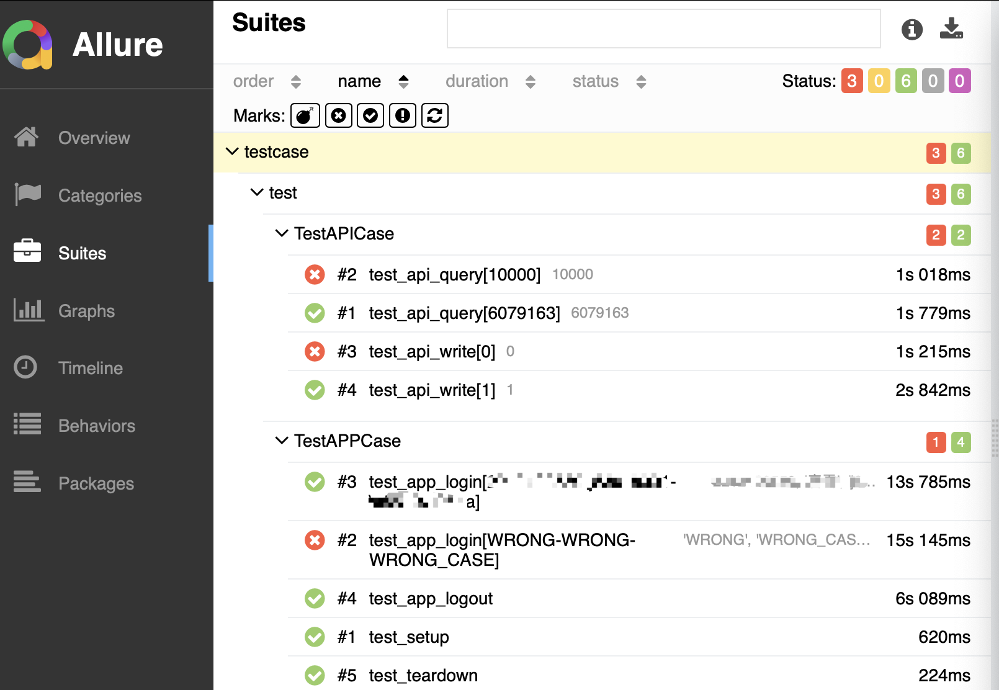

# SimpleDemo
## Python+Appium+requests+Pytest+Allure自动化测试框架

本项目是一个基于appium、requests的自动化测试框架，可实现原生Android APP、HTTP API的自动化测试，并基于Allure生成测试报告。

### 环境要求
| 名称 | 版本 |   
| Python | >=3.7 |   
| Appium | 2.4.1 |   
| Selenium | 4.11.2 |  
| Appium-Python-Client | 2.11.1 |   
| webdriver-manager | 4.0.1 |   
| pytest | 7.4.4 |   
| requests | 2.28.1 |    
| allure-pytest | 2.13.2 |  

在Windows 10、MACOS上运行通过

### 项目目录结构
common：常用的公共方法,基于selenium API封装的基本操作  
conf：项目配置数据文件和测试数据  
pageobj: 测试界面基本操作定义  
report：测试报告  
testcase：测试用例集  
main.py：主函数
pytest.ini：pytest配置文件

### 测试用例说明
1. testcase目录下test.py包含两个class：TestAPPCase、TestAPICase，分别对应APP、API自动化测试。  
其中test_app_login、test_api_query、test_api_write分别包含success、fail的测试用例数据。

### 运行说明
#### 前置要求
1. 按环境要求，完成必要依赖的安装  
2. 准备一台可adb连接的Android设备，确认adb connect可成功连上  
3. API测试使用gorest资源，需要提前获取token  
4. 本项目以QQ Android 9.0.15版本为例，需要提前安装对应版本QQ并登录过（新设备首次登录会出现验证码）   
5. 修改common目录下conf.yml中配置，为实际运行环境的内容（如device name/ OS version/ 登录信息/ API token）   
#### 运行项目
1. 启动appium服务  
2. 运行main.py文件

### 运行结果
运行成功后，预期结果应包含3个failed（错误测试数据导致），和6个passed
```
=========================== short test summary info ============================
FAILED testcase/test.py::TestAPPCase::test_app_login[WRONG-WRONG-WRONG_CASE]
FAILED testcase/test.py::TestAPICase::test_api_query[10000] - assert 0
FAILED testcase/test.py::TestAPICase::test_api_write[0] - assert 0
=================== 3 failed, 6 passed, 1 warning in 46.78s ====================
```  


### TODO
- 测试报告邮件、IM通知  
- 测试结果保存，历史运行结果趋势分析  
- 可接入web平台，便于触发运行和查看测试结果  
- 集成CI/CD
